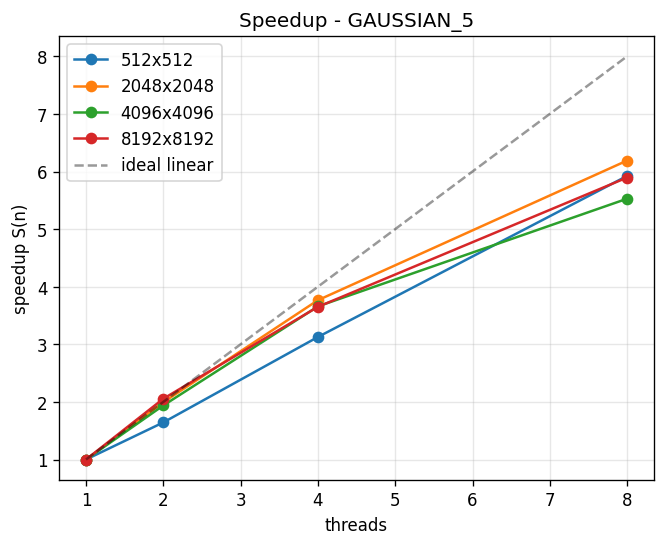
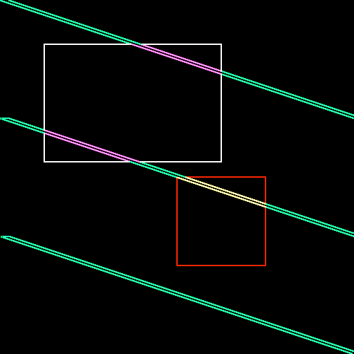

# Parallel 2D Image Convolution — Java Threads

A multi-threaded 2D image-convolution engine that compares a **sequential baseline**
against a **parallel implementation** on a multi-core CPU. The project benchmarks
speedup and efficiency across four filters, four image sizes, and four thread counts,
and explains the results with core parallel-programming concepts.

> CENG-479 Parallel Programming — Spring 2026 term project.

---

## Overview

2D convolution slides a small `k × k` kernel over every pixel of an image and replaces
it with a weighted sum of its neighbourhood — the basis of Gaussian blur, box blur,
sharpening, and Sobel edge detection. Each output pixel is computed independently, which
makes the problem **embarrassingly parallel**: the work can be split across CPU cores with
no locking.

This repository contains both a single-threaded baseline and a thread-pool–based parallel
engine (Java `ExecutorService`), plus a benchmark harness and plotting scripts that produce
the speedup/efficiency tables and charts.

## Results at a glance

| Metric | Result |
|---|---|
| Peak speedup | **6.43×** (Gaussian 15×15, 8 threads) |
| Peak efficiency | **≈ 80 %** of ideal 8× |
| Scaling (low thread counts) | ~2× at 2 threads, ~3.2–3.8× at 4 threads |
| Correctness | **12/12** parallel runs byte-identical to sequential |
| Hardware | Intel Core i5-8265U (4 cores / 8 threads), 20 GB RAM |



Edge detection on a synthetic test image (sequential vs. parallel produce identical output):



## Project structure

```
.
├── src/convolution/
│   ├── PixelImage.java         # image as packed-RGB int[] (row-major)
│   ├── Kernel.java             # kernel matrices: Gaussian, box, sharpen, Sobel
│   ├── Filter.java             # a filter = one kernel, or a Sobel (Gx, Gy) pair
│   ├── Convolver.java          # per-pixel math (shared by sequential & parallel)
│   ├── ConvolutionTask.java    # parallel worker: convolves one row stripe
│   ├── ParallelConvolver.java  # ExecutorService row-wise parallel engine
│   ├── Main.java               # visual demo (applies all filters, saves PNGs)
│   ├── Verify.java             # correctness gate: parallel == sequential
│   └── Benchmark.java          # benchmark harness → CSV results
├── scripts/
│   ├── build.ps1               # compile all sources to out/
│   └── run-bench.ps1           # build + run the full benchmark
├── analysis/
│   ├── plot.py                 # CSV → speedup/efficiency charts
│   └── requirements.txt        # pandas, matplotlib
└── results/                    # generated CSVs and PNG charts
```

## Components

### Sequential baseline
`Convolver` holds the single, authoritative copy of the per-pixel convolution math and
provides `convolveSequential(...)`, which runs the whole image on one thread. This is the
reference time `T(1)` for all speedup calculations.

### Parallel engine
`ParallelConvolver` splits the output rows into `N` contiguous stripes (one per thread) and
submits each as a `ConvolutionTask` to a fixed-size `ExecutorService` thread pool. Threads
read the shared input and write to **disjoint** output rows, so no lock is needed and there
is no false sharing. Both versions call the same `convolveRows` routine, which guarantees
identical output.

### Benchmark harness
`Benchmark` runs the full 4 × 4 × 4 matrix plus a Gaussian kernel-size sweep. Each cell uses
2 warm-up runs (JIT) and 5 timed runs with a trimmed mean (drop min/max). It writes
`benchmark.csv`, `kernel_sweep.csv`, and a separate `io_timing.csv`.

### Plotting
`analysis/plot.py` reads the CSVs and renders speedup-vs-threads, efficiency, speedup-vs-size,
and kernel-sweep charts to `results/`.

## Requirements

- **OpenJDK 21** (plain `javac` / `java`; no Maven or Gradle)
- **Python 3.12+** with `pandas` and `matplotlib` (for plotting only)
- Windows with PowerShell (the helper scripts are `.ps1`)

## Build & Run

```powershell
# 1) Compile
powershell -File scripts/build.ps1

# 2) Visual demo — applies all four filters, writes results/demo_*.png
java -cp out convolution.Main

# 3) Correctness check — parallel output must equal sequential (12/12 PASS)
java -cp out convolution.Verify

# 4) Full benchmark — writes results/*.csv (takes a few minutes)
powershell -File scripts/run-bench.ps1

# 5) Charts — writes results/*.png
python -m pip install -r analysis/requirements.txt
python analysis/plot.py
```

## How it works (design)

The output image is divided into horizontal row stripes — a **domain-decomposition**
strategy. Because every pixel costs the same amount of work, equal-sized stripes give each
thread a balanced load, so no work-stealing is required. Row-major storage keeps each
thread's memory accesses contiguous (good cache locality), and the disjoint, row-aligned
output regions are far larger than a cache line, avoiding false sharing.

Measured speedup scales near-linearly up to 4 threads, then flattens from 4 to 8 because the
CPU has 4 physical cores and 8 logical threads (simultaneous multithreading shares execution
units). At large image sizes speedup is bounded by memory bandwidth, and end-to-end speedup
is bounded by the fixed image-I/O cost (Amdahl's Law).
